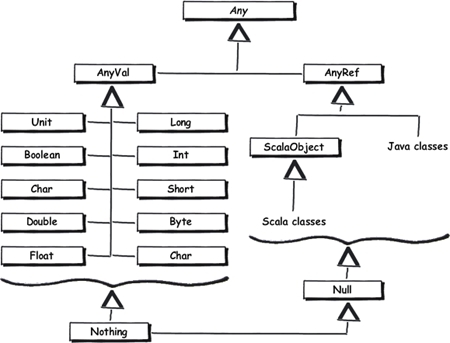

### На подумать:

---

 - Можно ли выразить анализ типов с предыдущей лекции как анализ над решетками? Если да, то как выглядит наша решетка? Если нет, то почему?

В принципе, для языка вполне можно построить решётку типов, введя типы для `top` и `bottom` решётки, например, для Scala это `Any` в качестве `top` и `Nothing` в качестве `bottom`: 

Однако стоит учесть, что если мы используем алгоритмы, основанные на поиске стационарной точки, нам нужно ввести дополнительный элемент - новую границу сверху, чтобы можно было отличить Any от некорректной переменной (например, неинициализированной).

---

- Можно ли выразить анализ над решетками как анализ типов?

Частично - да, тот же Subtyping, но я не очень представляю, как в таком случае решать ряд проблем, связанных именно с порядком выполнения команд, которые решаются при помощи алгоритмов на решётках - например, нахождения неинициализированных переменных.

---

### На поделать:

---

- Допишите метод `transfer` в трейте `IntraprocSignAnalysisFunctions`.

В текущей версии, подозреваю, речь идёт о методе [localTransfer](../src/tip/analysis/SimpleSignAnalysis.scala) в классе `SimpleSignAnalysis.Scala`.

В методе реализованы две вещи:

- При объявлении переменных все они попадают в map контекста с значением в виде bottom ;
- При задании переменной её тип в контексте обновляется результатом `eval` правой части выражения.

---

- Реализуйте класс [PowersetLattice](../src/tip/lattices/GenericLattices.scala) в файле `GenericLattices`.

Для обычного булеана aka powerset lattice:

- Bottom - пустое множество;
- Точная верхняя грань aka LUB для элементов x и y - их объединение. 

