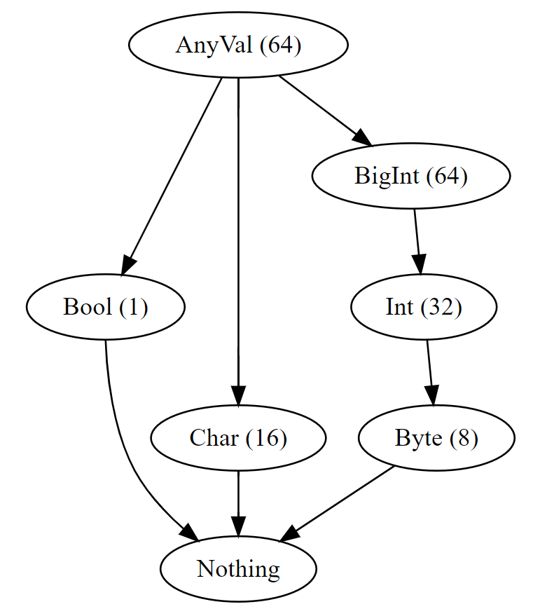
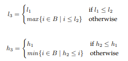
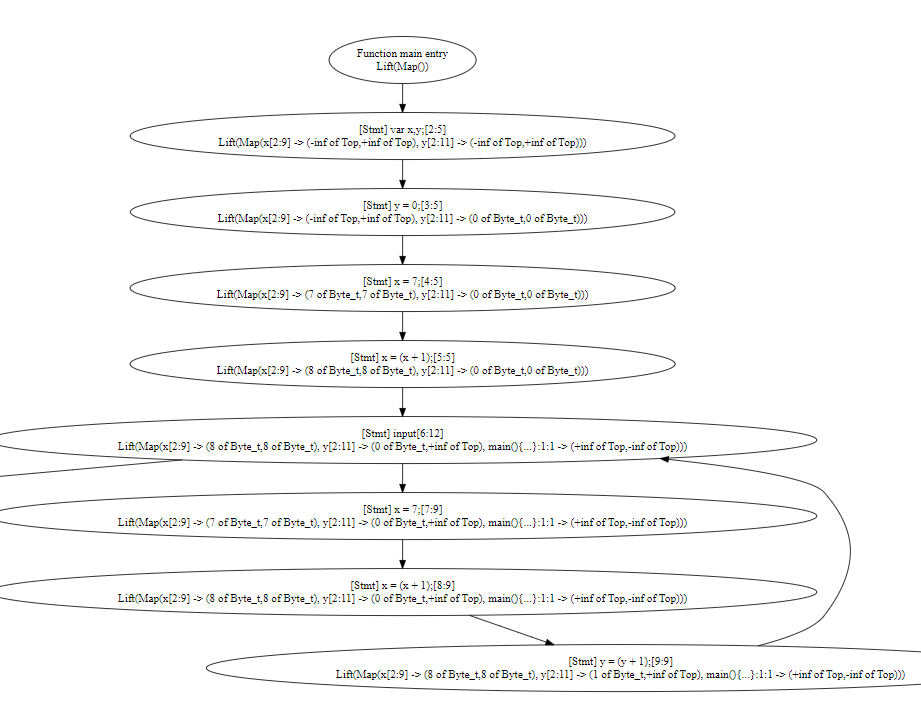
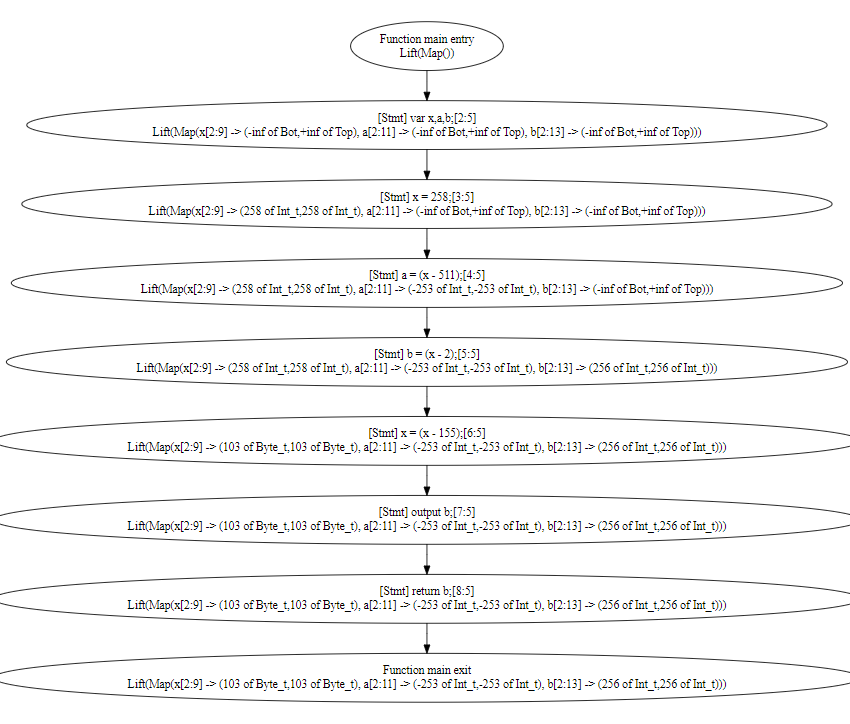

### На подумать:

---

Допустим, мы хотим реализовать оптимизирующий компилятор
для языка TIP. Среди прочего, для работы ему требуется
информация о размерах различных переменных.
- bool (1 bit)
- byte (8 bit signed)
- char (16 bit unsigned)
- int (32 bit signed)
- bigint (any integer)
- any (any thing)

- Предложите решетку для реализации анализа размера переменных, опишите правила вычисления различных выражений.

Созданная решётка выглядит примерно следущим образом:

Стоит отметить:
- Типы `bool` и `char` специально вынесены отдельно от иерархии чисел - с ними, конечно, можно проводить различные вычисления 
(например, С-подобное прибавление 1 к `char`'у и получение следующего элемента в списке), но мне кажется, что так делать не стоит, и 
если всё же нужны 16-битные числа, то лучше ввести отдельный тип `short`, а `char` оставить специально для хранения символьных переменных.
Плюс, я не очень уверен, что любое 16-битное значение будет являться корректным символом разльчных кодировок, что потенциально
может привести к проблемам;
- Числовые типы (`byte`/`int`/`bigint`) вынесены в отдельный "путь" в решётке, при этом `bigint` ограничен размером в 64 бита. Если бы не предыдущий 
пункт, касающийся использования типов `bool` и `char`, то его можно было бы оставить неограниченным в размерах и потенциально использовать 
как вершину нашей решётки, но из-за принятого решения он не сможет объединить, например, `char` и `int`.

Один из вариантов правил для операций:
- Модификации логических операций примерно аналогичны модификациям, описанным при введении типа `bool` в предыдущих работах;
- Математические операции разрешены только над математическими типами (`byte`/`int`/`bigint`) и приводят к тому, что результат
может быть выражен вышележащим в решётке типом из-за возможного переполнения. При работе с `bigint`, результат операции сохраняет тип
`bigint`, чтобы не "улетать" в `any` и оставить тип переменной числовым, хоть и потенциально потерять данные из-за переполнения.

| code                                         | type                                                                                       |
|----------------------------------------------|--------------------------------------------------------------------------------------------|
| $I$                                          | $I = anyVal(64)$                                                                         |
| $E_1 == E_2$                                 | $E_1 = E_2 \land E_1 == E_2 = Bool$                                                  |
| $E_1 > E_2$                                  | $E_1 = E_2 \land E_1 == E_2 = Bool$                                                  |
| $E_1 \ mathOper \ E_2$                       | $E_1 = E_2 = Byte \land E_1 mathOper E_2 = int$                                      |
| $E_1 \ mathOper \ E_2$                       | $E_1 = E_2 \land (E_1 != Byte \lor E_2 != Byte) \land E_1 mathOper E_2 = bigInt$ |
| $input$                                      | $input = anyVal$                                                                         |
| $X = E$                                      | $X = E$                                                                                |
| $output \ E$                                 | $E = anyVal$                                                                             |
| $if \ (E) \ \{ S \}$                         | $E = bool$                                                                               |
| $if \ (E) \ \{ S \} \ else \ \{ S \}$        | $E = bool$                                                                               |
| $while(E) \ \{ S \}$                         | $E = bool$                                                                               |
| $f(X_1, \dots, X_N) \ \{ \dots return E; \}$ | $f = (X_1, \dots, X_N) \rightarrow E$                                              |
| $(E)(E_1, \dots, E_N)$                       | $E = (E_1, \dots, E_N) \rightarrow (E)(E_1, \dots, E_N)$                           |
| $\\& E$                                      | $\\& E = \\& E$                                                                        |
| $alloc \ E$                                  | $alloc \ E = \\& E$                                                                    |
| $null$                                       | $null = \\& \alpha$                                                                      |
| $*E$                                         | $E = \\& *E$                                                                           |
| $*X = E$                                     | $X = \\& E$                                                                            |

Однако, на практике при применении данных правил возник ряд проблем:
- Необходимо каким-то образом специализировать ввод данных или использовать операции приведения вводимого `any` к необходимому нам типу.
Иначе, например, тип `char` не получится получить никаким образом;
- При использовании нескольких последовательных математических операций тип всё равно неадекватно быстро "улетает" вверх
по решётке: например, `x = 1; x = x + 1; x = x + 1;` приведёт нас к цепочке типов `byte -> int -> bigint` при значении x равному 3, что
может спокойно продолжать храниться в `byte` и использовать 8, а не 64 бита информации.

---

### На поделать:

---

- Допишите реализацию метода widen в [IntervalAnalysisWorklistSolverWithWidening](../src/tip/analysis/IntervalAnalysis.scala);
- Реализуйте придуманный вами анализ размера переменных.

Для реализации `widen` было использовано следующее правило: 

---
  
Для решения второй проблемы (для решения первой пришлось бы несколько переписать грамматику tip'а) можно использовать интервальный анализ:
- Используем интервальный анализ для получения граничных значений интервала для каждой переменной;
- Сопоставляем этим значениям типы из введённой нами решётки.

Для этого была реализована отдельная решётка [TypeSizeLattice](../src/tip/lattices/TypeSizeLattice.scala), в которой реализована
описанная выше матрица и переопределены значения типов в результате 6 базовых операций. 

Затем были изменены классы, представляющие значения границ интервалов в интервальном анализе в 
[IntervalLattice](../src/tip/lattices/IntervalLattice.scala) - теперь значения хранят не только своё числовое значение, но и типы.

Затем был реализован класс [TypeSizeAnalysis](../src/tip/analysis/TypeSizeAnalysis.scala) и добавлена возможность использования анализа типов
при помощи флагов `-typeSize wlrw`.

Результат тестировался на нескольких примерах, например, на  [interval0.tip](../examples/interval0.tip):

и [typeSize.tip](../examples/typeSize.tip):

В результате получилось, например, корректно определить тип переменной при изменении её значения (`x = 258; x = x-155;` : `x -> (258 of Int_t, 258 of Int_t) | x -> (103 of Byte_t, 103 of Byte_t)`).

